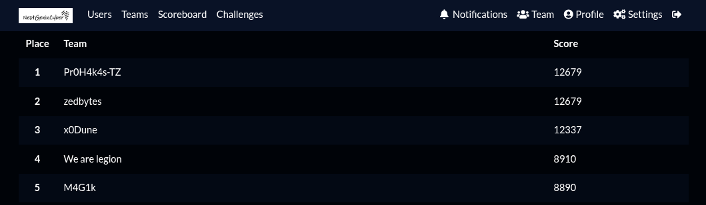

The SADC NextGenCyber CTF 2025 is a Capture The Flag competition for aspiring cybersecurity professionals from the Southern African Development Community (SADC) region. It was an online competion who started th 03 Novemver 00:00 2025 and lasted for four days. Our team "We are legion" arrived at 4th over 68 teams

There some Write-ups

[Web Write-ups](web.md)

[Osint Write-ups](osint.md)

[Boot2Root Write-ups](boot2root.md)