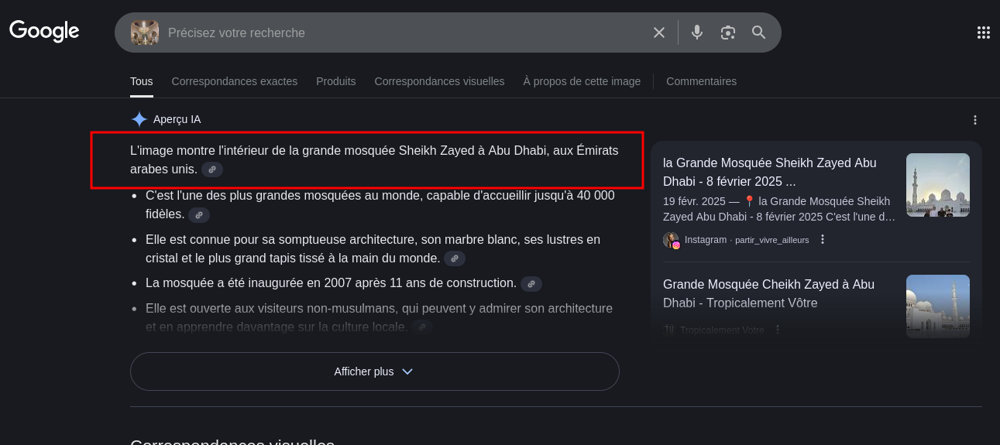
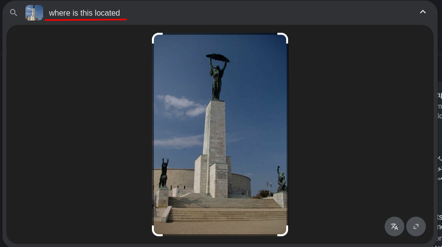
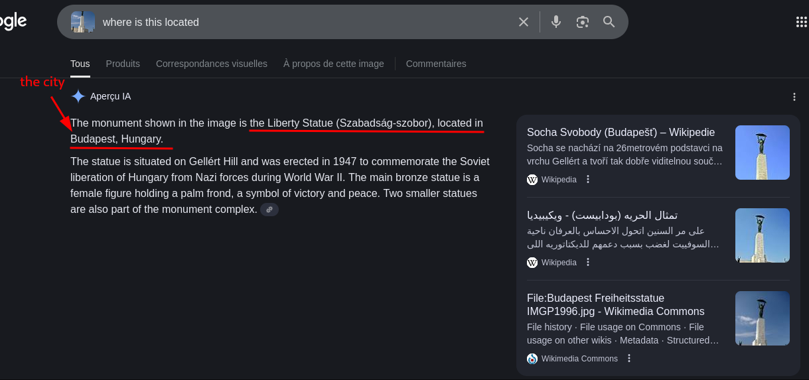
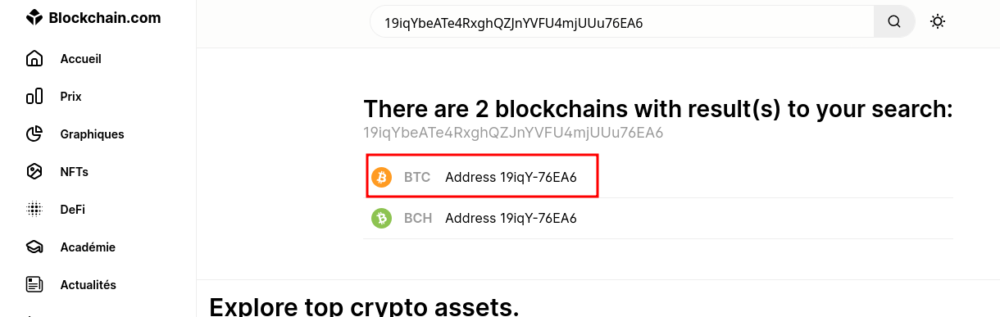
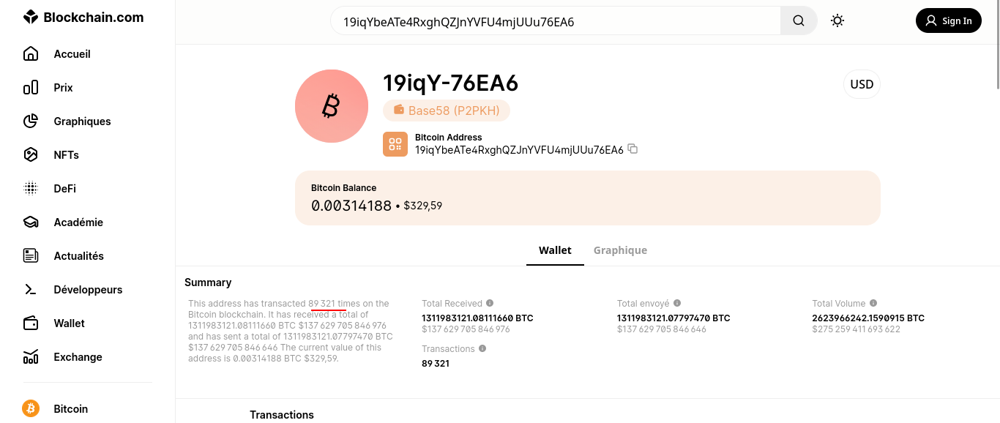
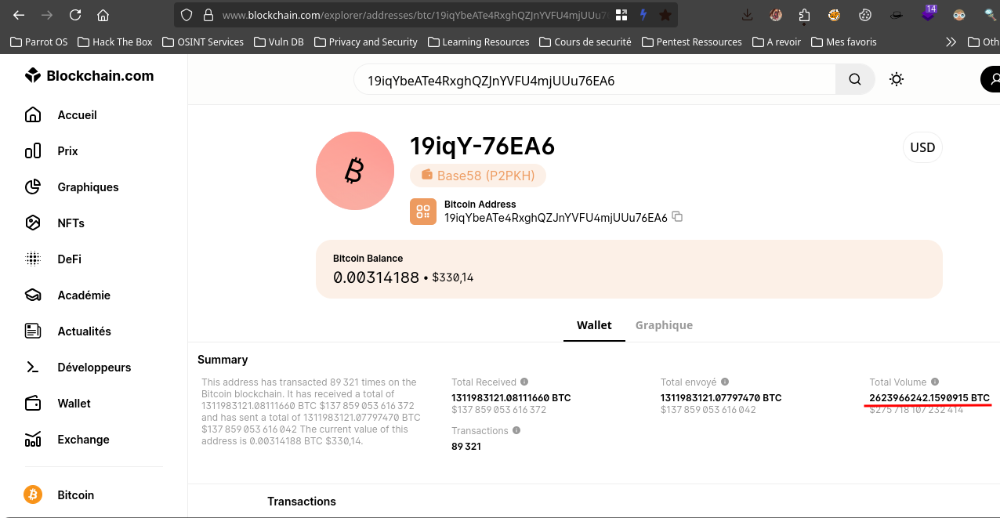
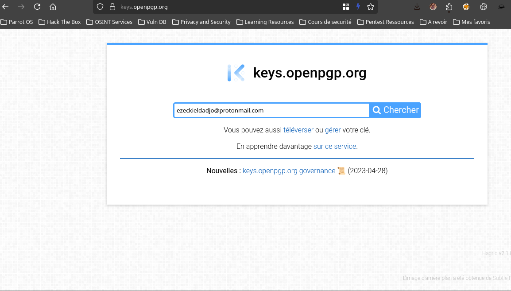
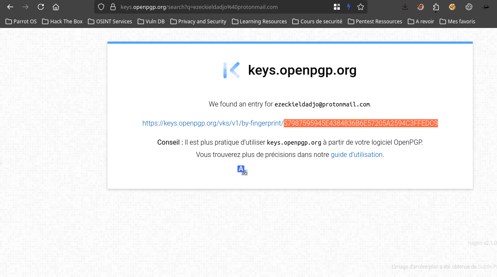

# Osint

## Agent 009 [100pts]

`For this challenge, participants will need to locate a place.
If the place found is "Saint Jean Church", you should put SADC{Saint Jean}`

the target :

we are an image so let make a image search with google 

you can see that we don't need to say anything google IA tell us where is and the flag will be `SADC{Sheikh Zayed}`

### Agent 009 found!!!

## Agent 007 [100pts]

`For this challenge, participants will need to locate a place.
Format: SADC{CITYNAME}`

the target:

like before let make some reverse image search with google but this time with some presision of what we want

and the result

so the flag will be `SADC{BUDAPEST}`

### Agent 007 found!!!

## New Currency 1 [100pts]

`Found the total number of transactions of this BTC address. 19iqYbeATe4RxghQZJnYVFU4mjUUu76EA6`

Here we need to know about the nulber of transactions this BTC address make !
So for this type of challenges there are some website you can use to retrieve needed information here two link but we have other i think 

[blockchain Explorer](https://www.blockchain.com/explorer)

[Bitref](https://bitref.com)

But in this challenge i got the result from Blockchain explorer so let begin

Here is the BTC adress `19iqYbeATe4RxghQZJnYVFU4mjUUu76EA6` !

So we go to blockchain explorer and paste the adress

and select the BTC Account and we got our result

and the flag will be `SADC{89321}`

### New Currency 1 found!!!

## New Currency 2 [100pts]

`Found the total volume of transactions of this BTC address. 19iqYbeATe4RxghQZJnYVFU4mjUUu76EA6
Flag format : SADC{xxxxxxxxxxxxxxx}`

like the challenge before it is the same process so i take the adress and paste it in the search bar of blockain explorer and :

so the flag is `SADC{2623966242.1590915}`

### New currency 2 found !!!

##  ProtonPgP  [100pts]

`Can you retrieve the PGP Keys of this email address, ezeckieldadjo@protonmail.com`

In this challenge we need to found the pgp keys of the email adress that we have here `ezeckieldadjo@protonmail.com`

a good ressource of this kind of challenge is [open PGP keys](https://keys.openpgp.org/)

so let's go here and get the keys

So the flag will be `SADC{57987595945E4384836B6E57205A2594C3FFEDC9}`

### Proton PGP  found!!!